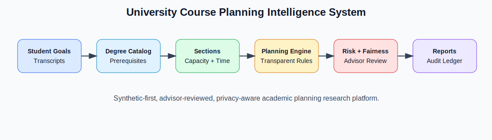
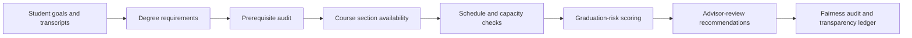

# University Course Planning Intelligence System

<p align="center"><strong>Research-grade academic advising and course-planning intelligence system for matching student goals, prerequisites, professor availability, course capacity, scheduling constraints, and graduation-risk signals.</strong></p>

<p align="center">
  <a href="../../actions/workflows/python-checks.yml"></a>
  <a href="LICENSE"></a>
  
  
</p>

> **Advisor-support boundary:** this repository uses fictional synthetic student, course, professor, capacity, and transcript records by default. It is research and planning-support infrastructure only. It must not automatically enroll students, deny course access, certify graduation eligibility, or replace academic advisors.

---

## Research objective

Can an AI-assisted university course planning system improve personalized academic advising by matching student goals, prerequisites, capacity, professor availability, and graduation-risk constraints while preserving transparency and human advisor oversight?

| Research question | Evidence generated locally |
| --- | --- |
| Which courses should a student consider next term? | Transparent next-term recommendations |
| Which courses are blocked? | Missing prerequisites, full sections, schedule clashes, overload checks |
| Which students face graduation risk? | Risk score, risk band, and risk-driver table |
| Which sections are bottlenecks? | Capacity pressure and blocked-option figures |
| Are recommendations uneven across groups? | Fairness audit by program, student group, and financial-aid sensitivity |
| Can advising decisions remain auditable? | Hash-chained audit ledger |

---

## Architecture

<p align="center"></p>



---

## Run today — no real student records needed

```bash
python scripts/run_synthetic_course_lab.py
```

Windows quick start:

```bat
cd %USERPROFILE%\university-course-planning-intelligence-system
git pull

py -m venv .venv
.venv\Scripts\activate

python -m pip install --upgrade pip
python -m pip install -r requirements.txt
python scripts/run_synthetic_course_lab.py
```

Optional controls:

```bash
python scripts/run_synthetic_course_lab.py --students 120 --seed 42
```

---

## Generated local outputs

```text
outputs/results/synthetic_course_catalog.csv
outputs/results/synthetic_professors.csv
outputs/results/synthetic_sections.csv
outputs/results/synthetic_students.csv
outputs/results/synthetic_transcripts.csv
outputs/results/synthetic_prerequisite_audit.csv
outputs/results/synthetic_course_recommendations.csv
outputs/results/synthetic_student_plan_summary.csv
outputs/results/synthetic_graduation_risk.csv
outputs/results/synthetic_fairness_audit.csv
outputs/results/synthetic_course_planning_summary.json
outputs/reports/synthetic_course_planning_report.md
outputs/audit/course_planning_audit_log.jsonl

outputs/figures/synthetic_graduation_risk.png
outputs/figures/synthetic_recommended_credits.png
outputs/figures/synthetic_capacity_pressure.png
outputs/figures/synthetic_fairness_gaps.png
outputs/figures/synthetic_bottleneck_courses.png
```

---

## What the system checks

| Area | Examples |
| --- | --- |
| Goal matching | Program-specific required courses for CS, Data Science, Cybersecurity, and Information Systems |
| Prerequisites | Missing prerequisite chains before recommending a section |
| Capacity | Full and nearly-full sections with bottleneck scoring |
| Professor availability | Section schedule alignment with professor availability patterns |
| Schedule feasibility | Time clash detection across recommended courses |
| Workload | Maximum next-term credit limits per student |
| Graduation risk | Remaining credits, course bottlenecks, GPA pressure, and limited course load |
| Fairness | Access and risk gaps across synthetic student groups |
| Transparency | Advisor notes and hash-chained audit events |

---

## Human governance boundary

This project is designed for research, simulation, and advisor review. Real institutional use requires FERPA/privacy review, accessibility review, academic-policy validation, registrar integration testing, appeal processes, and explicit human advisor oversight.

The system should never be used as the sole basis for course access, financial-aid eligibility, graduation certification, probation decisions, or student ranking.

---

## Repository map

```text
src/courseplan/
  synthetic.py        # fictional university data generator
  prerequisites.py   # prerequisite and capacity eligibility checks
  planner.py         # transparent next-term recommendation engine
  risk.py            # graduation-risk scoring
  fairness.py        # subgroup access and risk audit
  audit.py           # hash-chained audit ledger
  visualization.py   # local figures
  reporting.py       # Markdown advisor report
scripts/
  run_synthetic_course_lab.py
docs/
  methodology.md
  advising_policy.md
  synthetic_lab.md
  report_template.md
tests/
  test_synthetic.py
  test_planning.py
  test_pipeline.py
  test_audit.py
```

---

## Limitations

- Synthetic data is useful for pipeline validation but cannot establish real-world advising accuracy.
- Graduation risk is a planning signal, not a student label.
- Fairness metrics are descriptive and require institutional review before policy use.
- Real deployments need secure student-information-system integration and human appeal workflows.
